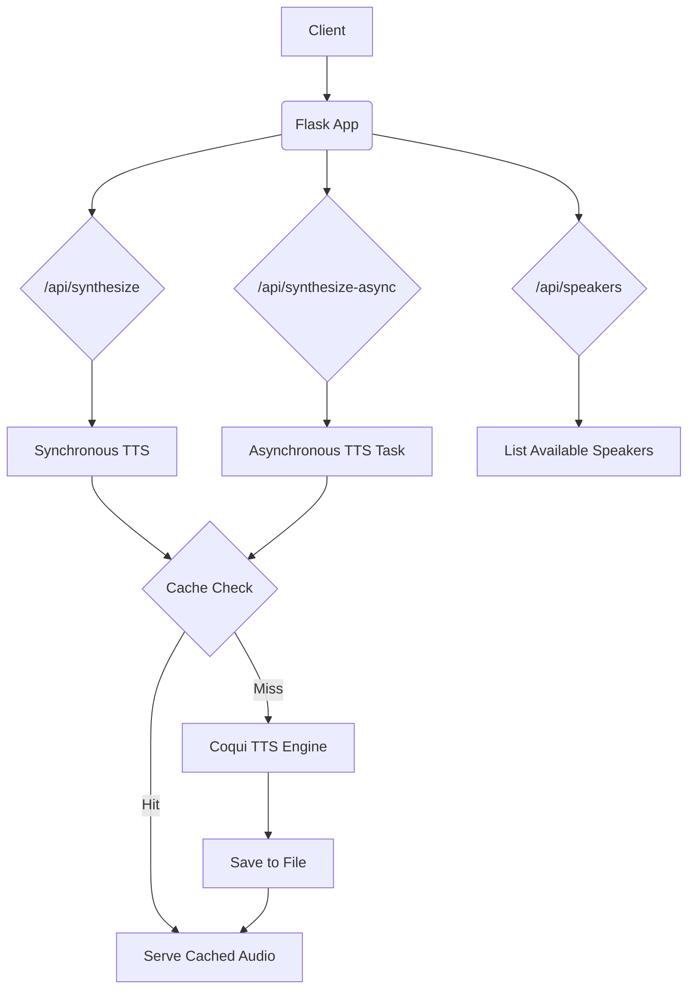

# Text-to-Speech (TTS) Backend

This backend service provides a robust and efficient Text-to-Speech (TTS) solution, leveraging Coqui TTS. It's designed for production use with features like audio caching, rate limiting, and asynchronous processing to handle TTS requests effectively.

## Features

- **High-Quality TTS Synthesis:** Utilizes Coqui TTS for natural-sounding speech generation.
- **Audio Caching:** Caches generated audio files to reduce redundant processing and provide faster responses for repeated requests.
- **Rate Limiting:** Protects the service from abuse with configurable rate limits on API endpoints.
- **Asynchronous Processing:** Offers an asynchronous endpoint for long-running TTS tasks, allowing clients to poll for results without blocking.
- **GPU Acceleration:** Automatically uses a CUDA-enabled GPU if available, for significantly faster processing.
- **SSML Support:** Supports Speech Synthesis Markup Language (SSML) for fine-grained control over speech output.

## Architecture

The backend is a Flask application that exposes a set of RESTful APIs for TTS synthesis.



The `arch.mermaid` file in the root of the backend directory provides a simplified view of the SSML handling logic.

## API Endpoints

### `POST /api/synthesize`

Synthesizes text to speech synchronously.

**Request Body:**

```json
{
  "text": "Hello world",
  "speaker": "p225",
  "speed": 1.0,
  "ssml": false
}
```

- `text` (string, required): The text to be synthesized.
- `speaker` (string, optional): The speaker ID to use. Defaults to the first available speaker.
- `speed` (float, optional): The speech speed. Defaults to `1.0`.
- `ssml` (boolean, optional): Whether the input text is SSML. Defaults to `false`.

**Response:**

- `200 OK`: Returns the audio file in `.wav` format.
- `400 Bad Request`: If no text is provided.
- `429 Too Many Requests`: If the rate limit is exceeded.

### `POST /api/synthesize-async`

Initiates an asynchronous TTS synthesis job.

**Request Body:**

Same as `/api/synthesize`.

**Response:**

- `202 Accepted`: Returns a JSON object with the job ID.

```json
{
  "job_id": "some-uuid",
  "status": "pending"
}
```

### `GET /api/status/<job_id>`

Checks the status of an asynchronous job.

**Response:**

- `200 OK`: Returns the job status.

```json
{
  "job_id": "some-uuid",
  "status": "complete",
  "url": "/api/audio/some-uuid"
}
```

- `404 Not Found`: If the job ID is invalid.

### `GET /api/audio/<job_id>`

Retrieves the audio file for a completed job.

**Response:**

- `200 OK`: Returns the audio file in `.wav` format.
- `404 Not Found`: If the job is not found or not complete.

### `GET /api/speakers`

Lists the available TTS speakers.

**Response:**

- `200 OK`: Returns a JSON array of speaker IDs.

```json
[
  "p225",
  "p226",
  ...
]
```

## Setup and Running

### Prerequisites

- Python 3.8+
- `pip`
- A Cuda-enabled GPU is recommended for better performance.

### Installation & Running

1.  **Clone the repository:**

    ```bash
    git clone https://github.com/your-repo/your-project.git
    cd your-project/backend
    ```

2.  **Create and activate a virtual environment:**

    ```bash
    python -m venv .venv
    source .venv/bin/activate
    ```

3.  **Install the dependencies:**

    ```bash
    pip install -r requirements.txt
    ```
    *Note: A `requirements.txt` file is not currently present in the repository. You can generate one using `pip freeze > requirements.txt` after installing the packages listed at the top of `app.py`.*

4.  **Run the application:**

    ```bash
    python app.py
    ```

The application will be available at `http://0.0.0.0:5002`.

## Housekeeping

### `voice_cloner.py`

The file `voice_cloner.py` is a standalone script for voice cloning and is not part of the main backend application. It is not used by the Flask app and can be safely removed to avoid confusion. It is recommended to remove it from the repository.

```bash
rm backend/voice_cloner.py
``` 